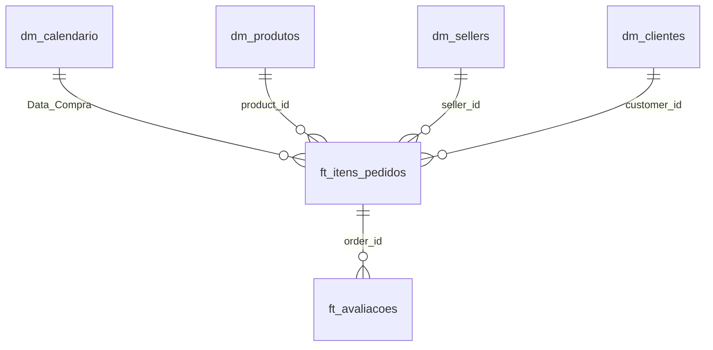

# Desafio Técnico - Analista de Dados | RZK Digital

Olá! Este repositório contém a minha resolução para o desafio técnico de Analista de Dados da **RZK Digital**, utilizando a base pública de e-commerce brasileiro (Olist).

O projeto foi estruturado com foco em boas práticas de engenharia e análise de dados: modelagem dimensional (Star Schema), consultas em Power Query (M), medidas em DAX e uma camada visual interativa seguindo à risca o guia de cores e design da RZK.

---

## 📌 Visão Rápida dos Resultados

### 1. Melhores Categorias de Produtos por Ano

| Ano | Maior Faturamento | Maior Volume de Vendas | Maior Nota Média (Geral) | Maior Nota Média (Consistente)* |
| :---: | :--- | :--- | :--- | :--- |
| **2016** | **Móveis Decoração** (R$ 5.690,52) | **Móveis Decoração** (65 itens) | **Alimentos** (5,0 ★ - 1 pedido) | **Móveis Decoração** (3,7 ★ - 64 avaliações) |
| **2017** | **Cama, Mesa e Banho** (R$ 490.596,92) | **Cama, Mesa e Banho** (5.135 itens) | **Artes e Artesanato** (5,0 ★ - 2 pedidos) | **Livros de Interesse Geral** (4,5 ★ - 226 avaliações) |
| **2018** | **Beleza e Saúde** (R$ 755.724,50) | **Beleza e Saúde** (5.841 itens) | **CDs e DVDs** (5,0 ★ - 1 pedido) | **Livros Importados** (4,6 ★ - 43 avaliações) *Livros Interesse Geral: 4,4 ★ (263 avaliações)* |

*\*Observação de análise:* Categorias com 1 ou 2 pedidos receberam nota 5,0 por acaso. Para trazer uma resposta útil para o negócio, filtrei também as categorias com volume relevante de avaliações, onde **Livros** se destacou com a melhor nota e consistência real.

---

### 2. Melhores Sellers por Ano

| Ano | Maior Faturamento | Maior Volume de Itens | Maior Nota Média (Consistente) |
| :---: | :--- | :--- | :--- |
| **2016** | `620c87c171fb...` (R$ 4.887,60 - Resende/RJ) | `620c87c171fb...` (24 itens) | `024b564ae893...` (5,0 ★ - 6 avaliações - Franca/SP) |
| **2017** | `53243585a1d6...` (R$ 177.557,31 - Curitiba/PR) | `cc419e0650a3...` (1.222 itens - Santo André/SP) | `48efc9d94a98...` (5,0 ★ - 33 avaliações perfeitas) |
| **2018** | `4869f7a5dfa2...` (R$ 136.164,90 - Guariba/SP) | `955fee9216a6...` (1.252 itens - São Paulo/SP) | `d9bd94811c33...` (4,8 ★ - 61 avaliações - São Bernardo/SP) |

---

### 3. Ticket Médio por Seller
- **Média geral entre sellers:** R$ 195,52
- **Mediana dos sellers:** R$ 105,14
- **Ticket médio da plataforma (Total R$ / Total Pedidos):** R$ 137,04

*Por que a média e a mediana são diferentes?*  
A distribuição é assimétrica à direita: metade dos lojistas vende produtos com ticket de até R$ 105. Porém, lojistas especializados em categorias de alto valor (como móveis de escritório, equipamentos de TI e instrumentos musicais) puxam a média para cima. O maior ticket médio recorrente pertence ao seller `59417c56835dd8e2e...` com média de R$ 2.025,50 por pedido.

---

## 🧱 Modelagem Dimensional (Star Schema)

Seguindo as orientações do desafio, estruturei a modelagem em tabelas fato (`ft_`) e tabelas dimensão (`dm_`):

- **`ft_itens_pedidos`**: Tabela fato principal no nível de item de pedido. Contém preço, frete e status de entrega (filtrada apenas para pedidos entregues).
- **`ft_avaliacoes`**: Fato com as notas de 1 a 5 e comentários dos clientes, relacionada pelo `order_id`.
- **`dm_calendario`**: Tabela dCalendar diária gerada com ano, mês, nome do mês em português, trimestre e dia da semana.
- **`dm_produtos`**: Dimensão de produtos com categoria padronizada e tratamento de nulos.
- **`dm_sellers`**: Cadastro de vendedores com cidade e estado.
- **`dm_clientes`**: Cadastro de compradores e localização geográfica.

---

## 🎨 Paleta de Cores RZK Digital

Apliquei as cores exatas passadas no documento:
- **Azul extra escuro:** `#063052` (Cabeçalhos e textos de destaque)
- **Azul escuro:** `#0C4165` (Barras principais e cartões)
- **Azul regular:** `#125379` (Barras de volume e gráficos secundários)
- **Azul claro:** `#8197AC` (Subtítulos e eixos)
- **Azul extra claro:** `#A8A7B1` (Linhas de grade e separadores)
- **Verde regular:** `#50C0AE` (KPIs em destaque, indicadores positivos)

---

## 📂 Organização dos Arquivos

- **`dashboard/`**: Contém o dashboard interativo (`index.html`) e o arquivo de dados (`dashboard_data.json`).
- **`powerbi/`**:
  - `power_query_models.m`: Código M pronto para colar no Editor Avançado do Power Query.
  - `dax_measures.dax`: Todas as medidas DAX comentadas (faturamento, volume, tickets, rankings).
  - `rzk_digital_theme.json`: Arquivo de tema com a paleta RZK para importar no Power BI.
- **`data_model/`**: Tabelas fato e dimensão já tratadas em formato CSV prontas para carregar.
- **`docs/`**: Relatório técnico com a explicação detalhada da análise (`RELATORIO_TECNICO_RZK.md`).

---

## 🖥️ Como Visualizar

1. **Dashboard Online:** Acesse diretamente pelo navegador em [jhonnybsilva.github.io/desafio-tecnico-rzk/](https://jhonnybsilva.github.io/desafio-tecnico-rzk/)
2. **Localmente:** Basta dar dois cliques no arquivo `dashboard/index.html`.
3. **Power BI:** Carregue os CSVs da pasta `data_model/` e aplique o tema `powerbi/rzk_digital_theme.json`.

---
Desenvolvido por **Jhonny Brasiliano da Silva** para o processo seletivo da RZK Digital.
