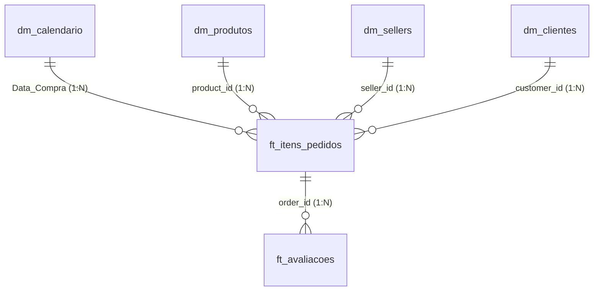

# 📊 Desafio Técnico: Analista de Dados - RZK Digital

Repositório contendo a solução completa de **Análise de Performance de E-Commerce**, **Modelagem Dimensional (Star Schema)** e **Visualização de Dados** para o processo seletivo da **RZK Digital**, utilizando o dataset público *Brazilian E-Commerce (Olist)*.

---

## 🎯 Objetivos do Projeto
- **Análise Exploratória e Métricas**: Avaliação crítica de desempenho por ano (2016 a 2018) para **Categorias de Produtos** e **Sellers** sob três perspectivas:
  1. Maior Faturamento
  2. Maior Volume de Itens Vendidos
  3. Maior Nota Média de Avaliação (Pura e com Relevância Estatística)
  4. Análise e Distribuição do Ticket Médio por Seller
- **Modelagem Dimensional**: Arquitetura em Esquema Estrela (*Star Schema*) no Power Query e Power BI com tabelas fato (`ft_`) e dimensão (`dm_`).
- **Visualização de Dados**: Interface moderna e intuitiva seguindo a paleta de cores corporativa da RZK Digital, evitando gráficos genéricos ou tabelas cruas.

---

## 🎨 Paleta de Cores Oficial RZK Digital
| Nome | Código Hexadecimal | Aplicação |
| :--- | :---: | :--- |
| **Azul Extra Escuro** | `#063052` | Cabeçalhos nobres, menus e alto contraste |
| **Azul Escuro** | `#0C4165` | Barras de navegação, cards e botões ativos |
| **Azul Regular** | `#125379` | Barras de dados de faturamento e divisores |
| **Azul Claro** | `#8197AC` | Subtítulos, rótulos de eixos e textos de apoio |
| **Azul Extra Claro** | `#A8A7B1` | Linhas de grade e elementos neutros |
| **Verde Regular** | `#50C0AE` | Indicadores de sucesso, KPIs positivos e acentos |

---

## 🏆 Resumo das Respostas aos Requisitos

### 1. Melhores Categorias de Produtos por Ano

| Ano | Perspectiva 1: Maior Faturamento | Perspectiva 2: Maior Volume de Itens | Perspectiva 3: Maior Nota Média (Pura) | Perspectiva 3: Maior Nota Média (Relevante)* |
| :---: | :--- | :--- | :--- | :--- |
| **2016** | **Móveis Decoração** (`R$ 5.690,52`) | **Móveis Decoração** (`65 itens`) | **Alimentos** (`5,00 ★` - 1 review) | **Móveis Decoração** (`3,66 ★` - 64 reviews) |
| **2017** | **Cama, Mesa e Banho** (`R$ 490.596,92`) | **Cama, Mesa e Banho** (`5.135 itens`) | **Artes e Artesanato** (`5,00 ★` - 2 reviews) | **Livros Interesse Geral** (`4,52 ★` - 226 reviews) |
| **2018** | **Beleza e Saúde** (`R$ 755.724,50`) | **Beleza e Saúde** (`5.841 itens`) | **CDs e DVDs Musicais** (`5,00 ★` - 1 review) | **Livros Importados** (`4,56 ★` - 43 reviews)<br>*(Livros Interesse Geral: 4,44 ★ - 263 reviews)* |

> *\*Critério de Relevância Estatística*: Elimina o viés de categorias de amostra única (1 venda com nota 5), revelando que a categoria de Livros possui a maior consistência em satisfação real do cliente.

---

### 2. Melhores Sellers por Ano

| Ano | Perspectiva 1: Maior Faturamento | Perspectiva 2: Maior Volume de Itens | Perspectiva 3: Maior Nota Média (Pura) | Perspectiva 3: Maior Nota Média (Relevante) |
| :---: | :--- | :--- | :--- | :--- |
| **2016** | `620c87c171fb...` (`R$ 4.887,60` - Resende/RJ) | `620c87c171fb...` (`24 itens`) | `024b564ae893...` (`5,00 ★` - 6 reviews) | `024b564ae893...` (`5,00 ★` - 6 reviews - Franca/SP) |
| **2017** | `53243585a1d6...` (`R$ 177.557,31` - Curitiba/PR) | `cc419e0650a3...` (`1.222 itens` - Santo André/SP) | `48efc9d94a98...` (`5,00 ★` - 33 reviews!) | `48efc9d94a98...` (`5,00 ★` - 33 reviews consecutivas!) |
| **2018** | `4869f7a5dfa2...` (`R$ 136.164,90` - Guariba/SP) | `955fee9216a6...` (`1.252 itens` - São Paulo/SP) | `c8c1bea22194...` (`5,00 ★` - 13 reviews) | `d9bd94811c33...` (`4,82 ★` - 61 reviews - São Bernardo/SP) |

---

### 3. Ticket Médio por Seller
- **Média Aritmética entre Sellers**: **R\$ 195,52**
- **Mediana da Distribuição**: **R\$ 105,14** (50% dos lojistas têm ticket até R\$ 105; a distribuição possui forte assimetria à direita causada por lojas de nicho de alto valor).
- **Ticket Médio Consolidado Geral da Plataforma**: **R\$ 137,04**
- **Top 3 Sellers em Ticket Médio** (mínimo de 10 vendas):
  1. `59417c56835dd8e2e72f91f809cd4092`: **R\$ 2.025,50** (Móveis de Escritório - Bento Gonçalves/RS)
  2. `40db9e9aa57f7bb151bcda6b0f9bdbb7`: **R\$ 1.930,67** (Equipamentos Agro/TI - Londrina/PR)
  3. `2bf6a2c1e71bbd29a4ad64e6d3c3629f`: **R\$ 1.687,63** (Instrumentos Musicais - Maringá/PR)

---

## 🏛️ Modelagem Dimensional (Star Schema)

A modelagem segue estritamente a padronização de nomenclatura solicitada:



- **`dm_calendario`**: Dimensão temporal com grão diário contínuo (Ano, Mês, Trimestre, Dia da Semana).
- **`dm_produtos`**: Dimensão de produtos com categoria saneada e tradução.
- **`dm_sellers`**: Dimensão de vendedores com cidade e UF.
- **`dm_clientes`**: Dimensão de compradores com localização geográfica.
- **`ft_itens_pedidos`**: Fato de transações de vendas no grão de item de pedido (`price`, `freight_value`, `order_status = 'delivered'`).
- **`ft_avaliacoes`**: Fato de satisfação do cliente (`review_score` de 1 a 5 estrelas).

---

## 📁 Estrutura do Repositório

```
├── dashboard/               # Aplicação de visualização interativa
│   ├── index.html           # Dashboard standalone em HTML5/JS responsivo
│   └── dashboard_data.json  # Base pré-calculada para renderização ultrarrápida
├── powerbi/                 # Arquivos para importação e modelagem no Power BI
│   ├── power_query_models.m # Código M completo para todas as tabelas
│   ├── dax_measures.dax     # Dicionário de fórmulas DAX comentadas
│   └── rzk_digital_theme.json # Arquivo de tema com a paleta oficial da RZK
├── data_model/              # Tabelas dimensionais tratadas em CSV (Star Schema)
│   ├── dm_calendario.csv
│   ├── dm_produtos.csv
│   ├── dm_sellers.csv
│   ├── dm_clientes.csv
│   ├── ft_itens_pedidos.csv
│   └── ft_avaliacoes.csv
├── docs/                    # Relatório técnico e executivo detalhado
│   └── RELATORIO_TECNICO_RZK.md
└── README.md
```

---

## 🚀 Como Executar o Projeto

### 1. Visualizar o Dashboard Interativo
Abra o arquivo `dashboard/index.html` diretamente em qualquer navegador (Chrome, Edge, Firefox). Ele não requer instalação de servidores ou bibliotecas locais.

### 2. Abrir no Power BI Desktop
1. No Power BI Desktop, importe o tema visual da RZK Digital em **Exibir > Temas > Procurar temas** e selecione `powerbi/rzk_digital_theme.json`.
2. Carregue as tabelas tratadas da pasta `data_model/`.
3. Adicione as medidas prontas do arquivo `powerbi/dax_measures.dax`.

---

**Autor:** Jhonny Brasiliano da Silva  
**Processo Seletivo:** Analista de Dados - RZK Digital
