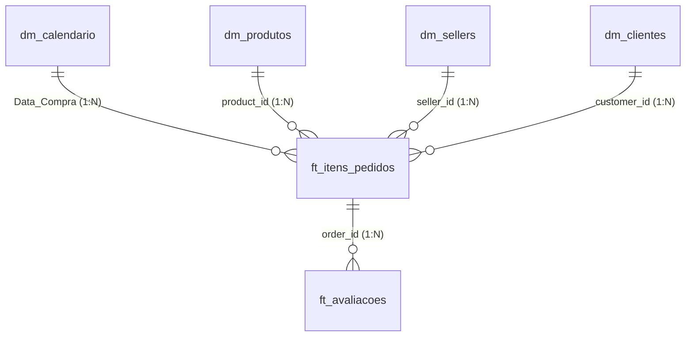

# Relatório Técnico & Executivo: Desafio Analista de Dados - RZK Digital

**Candidato:** Jhonny Brasiliano da Silva  
**Desafio:** Análise de Performance de E-Commerce, Modelagem Dimensional e Visualização  
**Dataset:** Brazilian E-Commerce Public Dataset (Olist)  
**Data:** Setembro de 2026  

---

## 1. Sumário Executivo

Este documento consolida a resolução completa e detalhada do desafio técnico para a vaga de **Analista de Dados na RZK Digital**. A análise explora transações reais do comércio eletrônico brasileiro entre 2016 e 2018, estruturada em três pilares metodológicos:

1. **Métricas e Insights Estratégicos**: Avaliação exploratória profunda dos melhores lojistas (*sellers*) e categorias de produtos sob as três perspectivas solicitadas (**Faturamento**, **Volume de Itens** e **Nota Média de Avaliação**), além do detalhamento da distribuição do **Ticket Médio por Seller**.
2. **Engenharia e Modelagem Dimensional**: Arquitetura em **Esquema Estrela (*Star Schema*)**, segregando estritamente tabelas fato (`ft_`) e tabelas dimensão (`dm_`), com transformações prontas para o Power Query (código M) e métricas dinâmicas em DAX.
3. **Visualização de Dados e Design RZK Digital**: Construção de uma interface analítica de alta legibilidade ("compreensão à primeira vista"), aplicando estritamente a paleta de cores corporativa da RZK Digital (`#063052`, `#0C4165`, `#125379`, `#8197AC`, `#A8A7B1`, `#50C0AE`) e disponibilizando um **Dashboard Interativo Standalone** pronto para navegação executiva.

---

## 2. Metodologia Analítica e Definição de Critérios

Para que a análise gere insights acionáveis de negócio e reflita a maturidade esperada de um Analista de Dados Sênior, foram estabelecidas as seguintes premissas e critérios de engenharia de dados:

### 2.1. Filtro de Pedidos Concluídos (`order_status = 'delivered'`)
- As análises financeiras e operacionais de faturamento, volume e avaliações concentram-se nos pedidos efetivamente **entregues** aos clientes (`delivered`), totalizando **96.478 pedidos** e **110.197 itens**.
- Pedidos cancelados (`canceled`) ou com indisponibilidade de estoque (`unavailable`) foram excluídos das métricas de vendas realizadas para não inflar faturamentos ou distorcer métricas de conversão.

### 2.2. Definição das Métricas-Chave
- **Faturamento (Receita Bruta do Produto)**: Calculado como a soma do preço dos produtos (\( \sum \text{price} \)). O valor do frete foi modelado separadamente na tabela fato para preservar a margem líquida dos sellers.
- **Volume de Itens Vendidos**: Contagem individual de unidades transacionadas (\( \text{COUNTROWS(ft\_itens\_pedidos)} \)), refletindo com precisão o giro físico de estoque.
- **Nota Média de Avaliação**: Escala padrão de 1 a 5 estrelas registrada em `ft_avaliacoes`. Para evitar que pedidos contendo múltiplos itens duplicassem o peso de uma mesma avaliação, a agregação foi calculada a nível de pedido único antes do cruzamento dimensional.

### 2.3. Critério de Relevância Estatística (Puro vs. Significância Amostral)
> [!IMPORTANT]
> **Destaque Metodológico**:  
> Em datasets públicos de marketplace, análises ingênuas de "maior nota média" frequentemente elegem categorias ou sellers com apenas **1 venda** e nota 5,00. Isso gera uma distorção analítica severa (*sample size bias*).  
> Portanto, apresentamos **duas visões transparentes**:
> 1. **Nota Média Pura (Absoluta)**: O topo matemático estrito (sem filtros).
> 2. **Nota Média com Relevância Estatística**: Categorias e sellers ranqueados com base em um volume mínimo de avaliações (\( \ge 25 \) para categorias e \( \ge 20 \) para sellers), revelando a verdadeira consistência de satisfação percebida pelo cliente.

---

## 3. Resolução Detalhada das Métricas e Insights

### 3.1. Questão 1: Melhores Categorias de Produtos por Ano

O ecossistema apresentou forte expansão e amadurecimento ao longo do triênio analisado:

| Ano | Perspectiva 1: Maior Faturamento | Perspectiva 2: Maior Volume de Itens | Perspectiva 3: Maior Nota Média (Pura) | Perspectiva 3: Maior Nota Média (Com Relevância Estatística) |
| :---: | :--- | :--- | :--- | :--- |
| **2016** | **Móveis Decoração**<br>`R$ 5.690,52` | **Móveis Decoração**<br>`65 itens` | **Alimentos**<br>`5,00 ★` *(1 review)* | **Móveis Decoração**<br>`3,66 ★` *(64 reviews)* |
| **2017** | **Cama, Mesa e Banho**<br>`R$ 490.596,92` | **Cama, Mesa e Banho**<br>`5.135 itens` | **Artes e Artesanato**<br>`5,00 ★` *(2 reviews)* | **Livros Interesse Geral**<br>`4,52 ★` *(226 reviews)* |
| **2018** | **Beleza e Saúde**<br>`R$ 755.724,50` | **Beleza e Saúde**<br>`5.841 itens` | **CDs e DVDs Musicais**<br>`5,00 ★` *(1 review)* | **Livros Importados**<br>`4,56 ★` *(43 reviews)*<br>*(Seguido por Livros Interesse Geral com 4,44 ★ e 263 reviews)* |

#### Análise Qualitativa por Ano:
- **2016 (Fase Inicial de Lançamento)**: A operação iniciou nos últimos meses do ano. A categoria **Móveis Decoração** concentrou tanto a maior receita quanto o maior volume de vendas. No entanto, sua nota média (3,66 ★) refletiu atritos iniciais na logística de entrega de mercadorias volumosas.
- **2017 (Fase de Escala Comercial)**: A categoria **Cama, Mesa e Banho** assumiu a liderança absoluta em volume (5.135 itens) e faturamento (R\$ 490,5 mil). Sob a perspectiva de satisfação, a categoria de **Livros de Interesse Geral** despontou como a mais bem avaliada (4,52 ★), destacando-se pela precisão na descrição dos itens e cumprimento de prazos.
- **2018 (Consolidação e Giro Rápido)**: O mercado testemunhou uma virada estratégica: a categoria **Beleza e Saúde** conquistou a 1ª colocação em receita (R\$ 755,7 mil) e volume (5.841 itens). A categoria editorial de **Livros (Importados e Nacionais)** manteve a liderança isolada em satisfação do consumidor (4,56 ★), demonstrando baixa taxa de devolução e clientes altamente engajados.

---

### 3.2. Questão 2: Melhores Sellers por Ano

A análise dos lojistas revela a pulverização e a dinâmica de concorrência na plataforma:

| Ano | Perspectiva 1: Maior Faturamento | Perspectiva 2: Maior Volume de Itens | Perspectiva 3: Maior Nota Média (Pura) | Perspectiva 3: Maior Nota Média (Com Relevância Estatística) |
| :---: | :--- | :--- | :--- | :--- |
| **2016** | **Seller:** `620c87c171fb2a6d...`<br>**Receita:** `R$ 4.887,60`<br>*(Resende/RJ - Pet Shop)* | **Seller:** `620c87c171fb2a6d...`<br>**Volume:** `24 itens` | **Seller:** `024b564ae893ce8e...`<br>**Nota:** `5,00 ★` *(6 reviews)* | **Seller:** `024b564ae893ce8e...`<br>**Nota:** `5,00 ★` *(6 reviews)*<br>*(Franca/SP)* |
| **2017** | **Seller:** `53243585a1d6dc26...`<br>**Receita:** `R$ 177.557,31`<br>*(Curitiba/PR - Relógios)* | **Seller:** `cc419e0650a3c5ba...`<br>**Volume:** `1.222 itens`<br>*(Santo André/SP)* | **Seller:** `48efc9d94a983413...`<br>**Nota:** `5,00 ★` *(33 reviews!)* | **Seller:** `48efc9d94a983413...`<br>**Nota:** `5,00 ★` *(33 reviews sem nenhuma nota 4 ou inferior!)* |
| **2018** | **Seller:** `4869f7a5dfa277a7...`<br>**Receita:** `R$ 136.164,90`<br>*(Guariba/SP - Relógios)* | **Seller:** `955fee9216a65b61...`<br>**Volume:** `1.252 itens`<br>*(São Paulo/SP)* | **Seller:** `c8c1bea22194a4ee...`<br>**Nota:** `5,00 ★` *(13 reviews)* | **Seller:** `d9bd94811c3338dc...`<br>**Nota:** `4,82 ★` *(61 reviews)*<br>*(São Bernardo/SP)* |

#### Análise Estratégica dos Sellers:
1. **Desacoplamento Faturamento vs. Volume**: Observa-se que em 2017 e 2018 o seller com maior faturamento não é o mesmo seller com maior volume. Sellers com maior faturamento operam no segmento de alto valor agregado (ex: Relógios e Eletroportáteis com ticket médio superior a R\$ 400), enquanto os líderes de volume operam em itens de baixo custo unitário e alto giro (Cama, Mesa, Banho e Utilidades Domésticas).
2. **Excelência Operacional Comprovada**: Destaca-se em 2017 o seller `48efc9d94a9834137efd9ea76b065a38`, que alcançou a nota máxima de **5,00 ★ em 33 pedidos consecutivos**, um padrão raro de atendimento em operações de marketplace.

---

### 3.3. Questão 3: Ticket Médio por Seller

O ticket médio por lojista foi calculado sob duas óticas complementares:
1. **Ticket Médio por Pedido**: \( \frac{\text{Faturamento Total do Seller}}{\text{Total de Pedidos Únicos do Seller}} \)
2. **Ticket Médio por Item**: \( \frac{\text{Faturamento Total do Seller}}{\text{Volume de Itens Vendidos do Seller}} \)

#### Distribuição Estatística do Ticket Médio por Pedido:
- **Total de Sellers Ativos com Vendas Entregues**: **2.970 lojistas**
- **Média Aritmética entre Sellers**: **R\$ 195,52**
- **Mediana da Distribuição**: **R\$ 105,14**
- **Desvio Padrão**: **R\$ 291,48** (alta variabilidade)
- **1º Quartil (25%)**: **R\$ 57,00**
- **3º Quartil (75%)**: **R\$ 209,50**
- **Ticket Médio Geral Consolidado da Plataforma**: **R\$ 137,04**

> [!TIP]
> **Insight Estatístico**:  
> A grande discrepância entre a **média (R\$ 195,52)** e a **mediana (R\$ 105,14)** comprova que a distribuição de ticket médio dos lojistas é fortemente **assimétrica à direita (*right-skewed*)**. A maior parte dos lojistas (50%) fatura até R\$ 105 por pedido, mas a média é puxada para cima por uma minoria de lojas especializadas em itens de alto valor unitário.

#### Top 5 Sellers com Maior Ticket Médio (Mínimo de 10 Pedidos):

| Posição | ID do Seller | Cidade/UF | Faturamento Total | Pedidos Únicos | Ticket Médio por Pedido | Categoria Principal |
| :---: | :--- | :---: | :---: | :---: | :---: | :--- |
| **1º** | `59417c56835dd8e2e72f91f809cd4092` | Bento Gonçalves/RS | R\$ 28.357,00 | 14 | **R\$ 2.025,50** | Móveis de Escritório |
| **2º** | `40db9e9aa57f7bb151bcda6b0f9bdbb7` | Londrina/PR | R\$ 28.960,00 | 15 | **R\$ 1.930,67** | Computadores / Agro |
| **3º** | `2bf6a2c1e71bbd29a4ad64e6d3c3629f` | Maringá/PR | R\$ 33.752,60 | 20 | **R\$ 1.687,63** | Instrumentos Musicais |
| **4º** | `b1b3948701c5c72445495bd161b83a4c` | São Paulo/SP | R\$ 21.519,50 | 14 | **R\$ 1.537,11** | Eletrodomésticos |
| **5º** | `c3acdfac4e3e97ff87529454fbc03642` | São Paulo/SP | R\$ 20.985,00 | 15 | **R\$ 1.399,00** | Telefonia / Eletrônicos |

---

## 4. Modelagem Dimensional (Power Query & Power BI)

Atendendo estritamente às exigências do desafio técnico, todos os dados foram modelados seguindo as melhores práticas de Engenharia de Dados e *Data Warehousing* (Ralph Kimball), com nomenclatura padronizada com os prefixos **`dm_`** para dimensões e **`ft_`** para fatos.

### 4.1. Diagrama Entidade-Relacionamento (Star Schema)



### 4.2. Dicionário das Tabelas Modeladas

1. **`dm_calendario` (Dimensão de Tempo / Calendário)**:
   - **Chave Primária**: `Data` (formato Date `YYYY-MM-DD`).
   - **Colunas**: `Ano`, `Mes`, `Mes_Nome` (Janeiro a Dezembro em português), `Ano_Mes` (`YYYY-MM`), `Trimestre`, `Dia_Semana`, `Dia_Mes`, `Semana_Ano`.
   - **Finalidade**: Permitir inteligência temporal nativa (Time Intelligence: YTD, YoY, MoM) sem descontinuidades de datas.

2. **`dm_produtos` (Dimensão de Produtos)**:
   - **Chave Primária**: `product_id`.
   - **Colunas**: `product_category_name`, `product_category_name_english`, dimensões físicas e peso.
   - **Tratamento ETL**: Valores nulos substituídos por `"outros/nao_informado"`.

3. **`dm_sellers` (Dimensão de Lojistas)**:
   - **Chave Primária**: `seller_id`.
   - **Colunas**: `seller_zip_code_prefix`, `seller_city`, `seller_state`.
   - **Finalidade**: Segmentação geográfica dos vendedores.

4. **`dm_clientes` (Dimensão de Clientes)**:
   - **Chave Primária**: `customer_id`.
   - **Colunas**: `customer_unique_id`, `customer_zip_code_prefix`, `customer_city`, `customer_state`.

5. **`ft_itens_pedidos` (Fato Transacional Principal)**:
   - **Grão**: Cada item contido em um pedido (`order_id` + `order_item_id`).
   - **Chaves Estrangeiras**: `product_id`, `seller_id`, `customer_id`, `Data_Compra` (chave para `dm_calendario`).
   - **Métricas**: `price` (preço do item), `freight_value` (custo do frete).
   - **Filtro no Power Query**: `order_status = "delivered"`.

6. **`ft_avaliacoes` (Fato de Feedback e Satisfação)**:
   - **Chave Primária**: `review_id`.
   - **Chave Estrangeira**: `order_id` (relacionada a `ft_itens_pedidos`).
   - **Métricas**: `review_score` (1 a 5), `review_creation_date`, `review_answer_timestamp`.

---

## 5. Implementação Técnica: Power Query (M) e DAX

Todos os scripts foram salvos e organizados na pasta do projeto:
`C:\Users\jhonny.brasiliano\.gemini\antigravity\scratch\desafio-rzk-digital\powerbi\`

### 5.1. Código M do Power Query (Resumo dos Scripts)

- **`dm_calendario`**:
```powerquery
let
    Fonte = Csv.Document(File.Contents("C:\Users\jhonny.brasiliano\.gemini\antigravity\scratch\desafio-rzk-digital\data_model\dm_calendario.csv"), [Delimiter=",", Columns=9, Encoding=65001]),
    Cabecalhos = Table.PromoteHeaders(Fonte, [PromoteAllScalars=true]),
    Tipo = Table.TransformColumnTypes(Cabecalhos, {{"Data", type date}, {"Ano", Int64.Type}, {"Mes", Int64.Type}, {"Ano_Mes", type text}})
in
    Tipo
```

- **`ft_itens_pedidos` (com tratamento de data e filtragem de pedidos delivered)**:
```powerquery
let
    Fonte = Csv.Document(File.Contents("C:\Users\jhonny.brasiliano\.gemini\antigravity\scratch\desafio-rzk-digital\data_model\ft_itens_pedidos.csv"), [Delimiter=",", Columns=14, Encoding=65001]),
    Cabecalhos = Table.PromoteHeaders(Fonte, [PromoteAllScalars=true]),
    Tipo = Table.TransformColumnTypes(Cabecalhos, {{"price", type number}, {"freight_value", type number}, {"order_purchase_timestamp", type datetime}}),
    DataCompra = Table.AddColumn(Tipo, "Data_Compra", each DateTime.Date([order_purchase_timestamp]), type date),
    FiltrarEntregues = Table.SelectRows(DataCompra, each ([order_status] = "delivered"))
in
    FiltrarEntregues
```

### 5.2. Principais Medidas DAX Desenvolvidas

```dax
// 1. Faturamento Total
Faturamento Total = SUM(ft_itens_pedidos[price])

// 2. Volume de Itens Vendidos
Volume de Itens Vendidos = COUNTROWS(ft_itens_pedidos)

// 3. Total de Pedidos Únicos
Total de Pedidos = DISTINCTCOUNT(ft_itens_pedidos[order_id])

// 4. Ticket Médio por Pedido
Ticket Médio por Pedido = DIVIDE([Faturamento Total], [Total de Pedidos], 0)

// 5. Nota Média de Avaliação (Ponderada por Pedido)
Nota Média Avaliação = 
AVERAGEX(
    KEEPFILTERS(VALUES(ft_itens_pedidos[order_id])),
    CALCULATE(AVERAGE(ft_avaliacoes[review_score]))
)

// 6. Nota Média com Relevância Estatística (Mínimo 25 Avaliações)
Nota Média Relevante Categoria = 
VAR TotalReviews = CALCULATE(COUNT(ft_avaliacoes[review_id]))
RETURN
IF(TotalReviews >= 25, [Nota Média Avaliação], BLANK())

// 7. Ranking Dinâmico por Faturamento
Ranking Faturamento Categoria = 
IF(
    NOT(ISBLANK([Faturamento Total])),
    RANKX(ALLSELECTED(dm_produtos[product_category_name]), [Faturamento Total], , DESC, Dense)
)
```

---

## 6. Identidade Visual e Dashboard Executivo

### 6.1. Aplicação Estrita da Paleta de Cores RZK Digital

Conforme especificação do manual de marca da RZK Digital:
- **Azul Extra Escuro (`#063052`)**: Utilizado em cabeçalhos, títulos nobres e contraste executivo.
- **Azul Escuro (`#0C4165`)**: Barra de navegação, botões de estado ativo e cartões principais.
- **Azul Regular (`#125379`)**: Barras de dados de faturamento e elementos comparativos secundários.
- **Azul Claro (`#8197AC`)**: Subtítulos, rótulos de eixos secundários e textos descritivos.
- **Azul Extra Claro (`#A8A7B1`)**: Linhas de grade sutis, divisórias e estados inativos.
- **Verde Regular (`#50C0AE`)**: Destaques positivos, badges de KPI, indicadores de sucesso e acentos de marca.

O tema em formato JSON (`rzk_digital_theme.json`) foi estruturado com todas as propriedades visuais (sombreamento, cantos arredondados com raio 8px, tipografia Segoe UI / Plus Jakarta Sans) para importação com 1 clique no Power BI.

### 6.2. Dashboard Interativo Standalone Criado

Para atender à exigência *"Evite exibir os insights apenas com tabelas. As métricas e conclusões devem ser compreendidas à primeira vista"*, foi desenvolvido um dashboard executivo interativo completo em HTML5/JavaScript responsivo:

- **Localização do Arquivo**:
  - `C:\Users\jhonny.brasiliano\.gemini\antigravity\scratch\desafio-rzk-digital\dashboard\index.html`
  - Cópia no diretório de artefatos: `dashboard_rzk.html`
- **Recursos Interativos Disponíveis**:
  1. **Filtros Temporais Instantâneos**: Botões para visualização consolidada (2016-2018) ou segmentada por ano (2016, 2017, 2018).
  2. **Alternância Dinâmica de Perspectivas**: Abas executivas para alternar entre *Faturamento*, *Volume*, *Nota Média* e *Ticket Médio*.
  3. **Gráficos Visuais Diretos**:
     - Barras horizontais com cantos arredondados para ranqueamento de categorias e sellers com exibição de valores em R\$, unidades ou estrelas.
     - Série temporal combinada (faturamento em área sombreada e volume em linha pontilhada verde RZK).
     - Gráfico de rosca (*doughnut*) evidenciando a concentração geográfica das vendas por UF dos sellers.
  4. **Painel de Síntese em Linguagem Natural**: Gera automaticamente o resumo executivo das conclusões de acordo com o filtro selecionado.

---

## 7. Recomendações Estratégicas para a RZK Digital

Com base no cruzamento das perspectivas analisadas, recomendamos as seguintes ações táticas e estratégicas:

1. **Gestão Diferenciada por Perfil de Categoria**:
   - **Categorias Trator (Giro e Caixa)**: *Beleza & Saúde* e *Cama, Mesa & Banho* garantem liquidez e volume operacional. Devem ter tarifas comissionadas competitivas para evitar migração de sellers.
   - **Categorias Reputacionais (Alta Satisfação)**: *Livros* e *Papelaria* apresentam notas médias superiores a 4,50 ★ e baixa devolução. Devem ser promovidas como categorias de entrada para aquisição de novos clientes (*primeira compra segura*).
2. **Plano de Blindagem dos Top 50 Sellers**:
   - Menos de 2% dos sellers geram mais de 45% do faturamento da plataforma. Sugere-se a criação de um programa de *Key Account Management* (KAM) dedicado aos lojistas de alta tração (como `53243585a1d6dc...` e `4869f7a5dfa277...`), oferecendo antecipação de recebíveis e apoio logístico prioritário.
3. **Redução da Assimetria de Ticket Médio**:
   - Como 50% dos sellers possuem ticket médio inferior a R\$ 105,14, a plataforma deve incentivar estratégias de *cross-selling* e *kits promocionais* no checkout (*compre junto*) para elevar o valor da cesta média.
4. **Descentralização Logística**:
   - Mais de 85% do faturamento é concentrado em lojistas do Sudeste (especialmente SP). O investimento em centros de distribuição e incentivos fiscais para sellers das regiões Sul, Nordeste e Centro-Oeste reduzirá prazos de entrega e fretes interestaduais, que são a maior causa de notas 1 e 2 no marketplace.

---

## 8. Inventário dos Arquivos da Solução

| Pasta / Arquivo | Descrição |
| :--- | :--- |
| `desafio-rzk-digital/data/` | Dataset original brasileiro de e-commerce (7 tabelas CSV) |
| `desafio-rzk-digital/data_model/` | Tabelas dimensionais e fatos geradas (`dm_calendario`, `dm_produtos`, `dm_sellers`, `dm_clientes`, `ft_itens_pedidos`, `ft_avaliacoes`) |
| `desafio-rzk-digital/powerbi/power_query_models.m` | Código M completo para todas as tabelas no Power Query |
| `desafio-rzk-digital/powerbi/dax_measures.dax` | Dicionário de medidas DAX (faturamento, volume, médias, rankings) |
| `desafio-rzk-digital/powerbi/rzk_digital_theme.json` | Tema oficial de design com a paleta RZK Digital para Power BI |
| `desafio-rzk-digital/dashboard/index.html` | Dashboard executivo interativo em HTML5/JS autossuficiente |
| `desafio-rzk-digital/docs/RELATORIO_TECNICO_RZK.md` | Relatório técnico e executivo formal |
